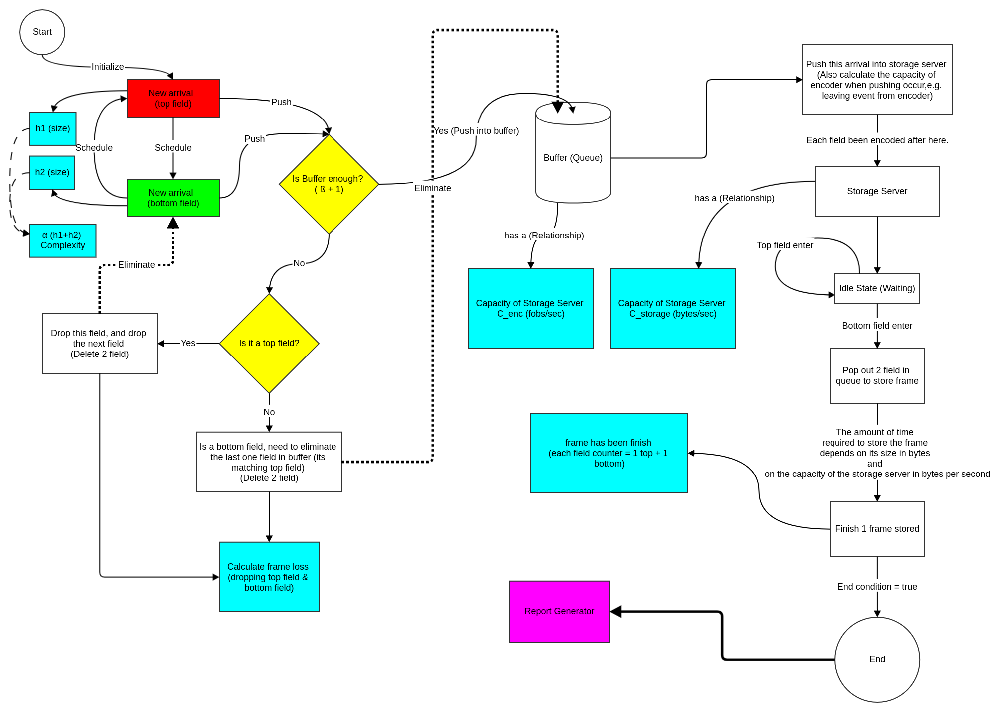

# simulation-video-encoder
Network simulation project, with some practices on video encoder server.

# usage

```bash
# compile
$ make
# generate document with docogen
$ make docogen
# clean all 
$ make clean
# clean doc dependencies
$ make cleandoc
# run example
$ make run
```

# flowchart

