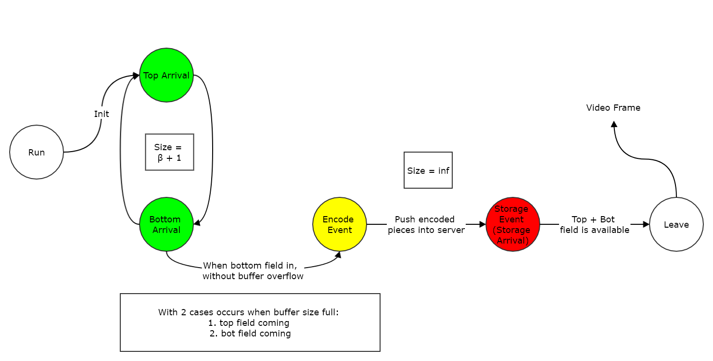
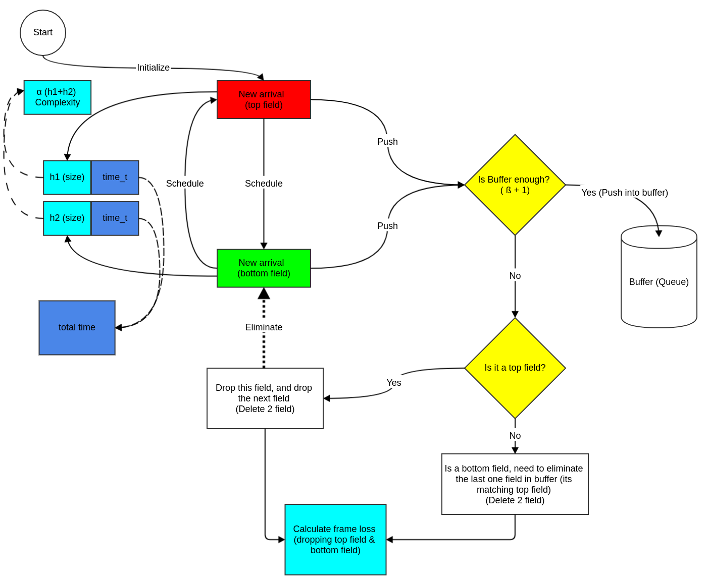
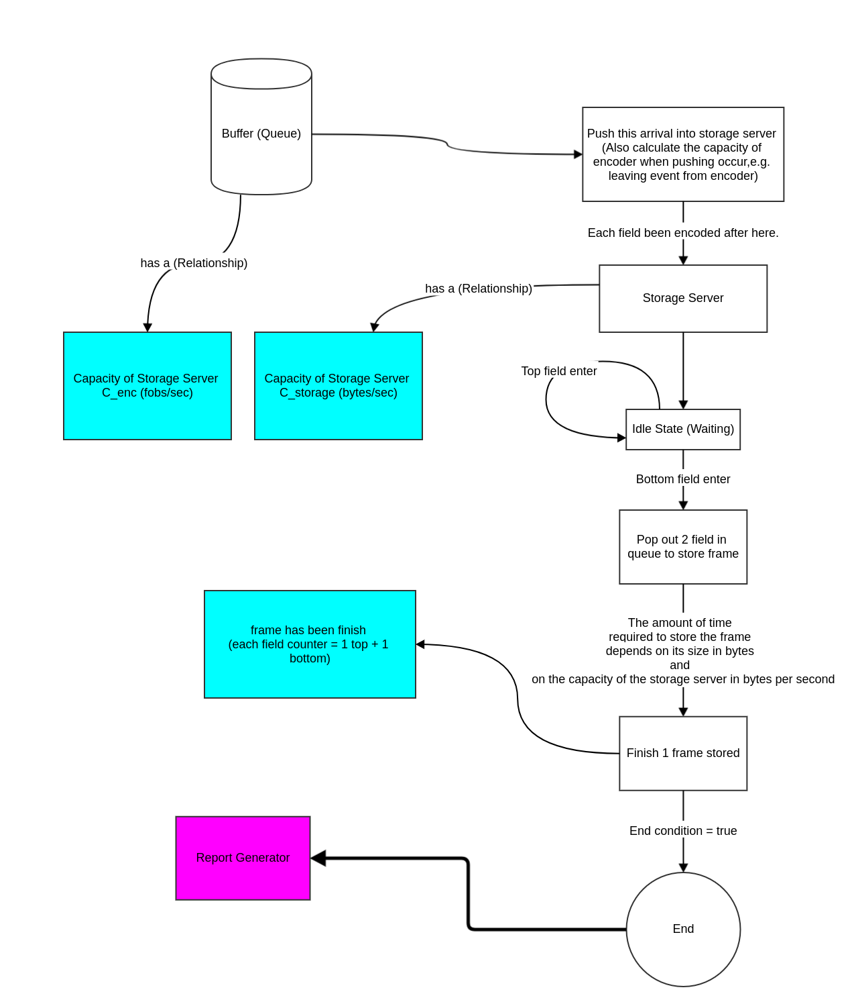
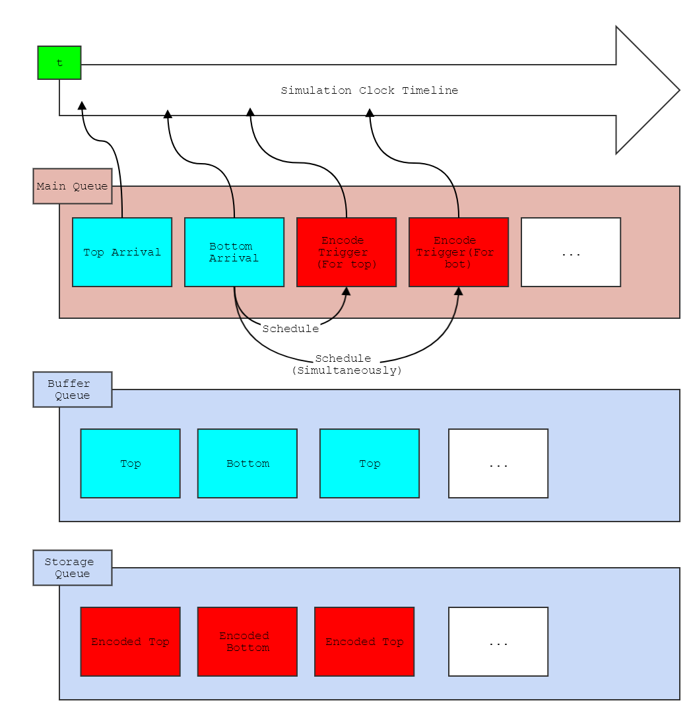

# simulation-video-encoder
Network simulation project, with some practices on video encoder server.

# Requirement
> My develope environment 
## Standard 
- gcc version 5.4,1
- GNU make 4.1
- GNU gdb 7.11.1

## Document/Report
- node.js (latest/v8.8.1)
  - docogen (v0.1.5)
- gnuplot (v5.0)

# Usage

```bash
# compile
$ make

# generate document with docogen
$ make docogen

# clean all 
$ make clean

# clean doc dependencies
$ make cleandoc

# run example
$ make run

```

## Project result export
```bash
# Project use case output
$ make proj

# plot the result
$ make plot

# combine together
$ make proj && make plot
```

## Debug 

```bash
# compile with gdb options
$ make gdb
# gdb run (with sample config)
$ make run_g
```

# Flowchart

## Entire system


## Simulation graph of system


## Initial routine


## Encoder routine


## Memory usage (Queue)


# Document 
- [simulation report paper](doc/simulation-report.pdf)
